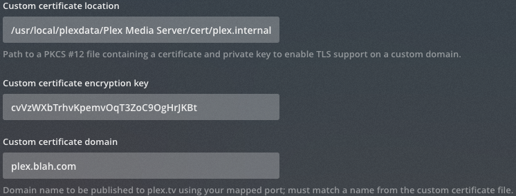

# plex-cert-acme-aws
[Plex](https://www.plex.tv/) Media Server SSL Certificate Generation Using [achme.sh](https://github.com/Neilpang/acme.sh) and [AWS](https://aws.amazon.com/) [Route 53](https://aws.amazon.com/route53/) DNS service to generate a [Lets Encrypt](https://letsencrypt.org/) SSL certificate for your home [Plex](https://www.plex.tv/) media Server.  You won't need to open any of your plex server ports to the internet as we will use DNS validation.

This guide is built for Plex running in a BSD jail.  I'm using the totally free version of PLex Media Server, I fon't have Plex pass or anything else.  I'm using [freenas](https://www.freenas.org/) and my jail is called `plex`.  This guide assumes you connect to your jail's shell as `root` and your plex server has been installed via the BSD pkg system with `pkg install plexmediaserver`.  This will mean that Plex runs as the `plex` user.  The plex user is created as part of the instalation process and has no login shell.  

If you are running Plex on linux, this guide will be able to help you too.  `curl` will probably already be installed so you won't need to follow that step, everything else should be more or less the same.

## Get curl
If your running a BSD jail, chances are you won't have `curl` installed. login to your jail as root, and install curl with:

```
pkg install curl
```

If prompted type <kbd>Y</kbd> or <kbd>y</kbd> if you are asked too.  Your output will probably look like this:

```
plex# pkg install curl
Updating FreeBSD repository catalogue...
[plex] Fetching meta.txz: 100%    944 B   0.9kB/s    00:01    
[plex] Fetching packagesite.txz: 100%    6 MiB   1.3MB/s    00:05    
Processing entries:   0%
Newer FreeBSD version for package vorbis-tools:
To ignore this error set IGNORE_OSVERSION=yes
- package: 1103000
- running kernel: 1102000
Ignore the mismatch and continue? [Y/n]: 
Processing entries: 100%
FreeBSD repository update completed. 32791 packages processed.
All repositories are up to date.
The following 3 package(s) will be affected (of 0 checked):

New packages to be INSTALLED:
	curl: 7.66.0
	libnghttp2: 1.39.2
	ca_root_nss: 3.47.1

Number of packages to be installed: 3

The process will require 5 MiB more space.
2 MiB to be downloaded.

Proceed with this action? [y/N]: y
[plex] [1/3] Fetching curl-7.66.0.txz: 100%    1 MiB 438.5kB/s    00:03    
[plex] [2/3] Fetching libnghttp2-1.39.2.txz: 100%  116 KiB 118.7kB/s    00:01    
[plex] [3/3] Fetching ca_root_nss-3.47.1.txz: 100%  287 KiB 293.5kB/s    00:01    
Checking integrity... done (0 conflicting)
[plex] [1/3] Installing libnghttp2-1.39.2...
[plex] [1/3] Extracting libnghttp2-1.39.2: 100%
[plex] [2/3] Installing ca_root_nss-3.47.1...
[plex] [2/3] Extracting ca_root_nss-3.47.1: 100%
[plex] [3/3] Installing curl-7.66.0...
[plex] [3/3] Extracting curl-7.66.0: 100%
=====
Message from ca_root_nss-3.47.1:

--
FreeBSD does not, and can not warrant that the certification authorities
whose certificates are included in this package have in any way been
audited for trustworthiness or RFC 3647 compliance.

Assessment and verification of trust is the complete responsibility of the
system administrator.


This package installs symlinks to support root certificates discovery by
default for software that uses OpenSSL.

This enables SSL Certificate Verification by client software without manual
intervention.

If you prefer to do this manually, replace the following symlinks with
either an empty file or your site-local certificate bundle.

  * /etc/ssl/cert.pem
  * /usr/local/etc/ssl/cert.pem
plex#

```


## Give the plex user login capabilities
You will need to be running a cron job and some scripts to get certificates and put them in the right place.  It's not a great idea to run these as root, so well modify the `plex` user so it can have a login shell and a home directory.

As root, first create the home directory for the plex userand set the ownership correctly with the following  with:

```
mkdir -p /home/plex
chown plex:plex /home/plex
```

Next, you'll need to change some attributes of the plex user so that you can login.  Type:

```
chpass plex
```
You'll be presented with an editor with the plex user current settings.  Change the `Home directory: ` value to `/home/plex`.  Change the `Shell: ` value to `/bin/sh`.  The editor window should look something like this:

```
#Changing user information for plex.
Login: plex
Password: *
Uid [#]: 972
Gid [# or name]: 972
Change [month day year]:
Expire [month day year]:
Class:
Home directory: /home/plex
Shell: /bin/sh
Full Name: Plex Media Server
Office Location:
Office Phone:
Home Phone:
Other information:
```
Exit the editor with a <kbd>ctrl</kbd> + <kbd>w</kbd> + <kbd>q</kbd>

You can test the shell works no by typing `su - plex`.
You should be logged in as the plex user.  You may notice your current directory is set to `/usr/home/plex` instead of `/home/plex`.  This is just due to BSD symlinking of `/home`.  Don't panic, you're in your new home directory!


## Create a location for the PKCS#12 archive
Plex likes to take a PKCS#12 archive for certificates.  This is a single archive that contains all the bits needed for your plex server UI to be secure.

A good place to create this is at `/usr/local/plexdata-plexpass/Plex Media Server/certs/`

Since you are already logged in as the plex user from the above step, just type:

`mkdir /usr/local/plexdata/Plex\ Media\ Server/cert'`

The backslashes are needed to "escape" the spaces in the path name.

## Get acme.sh
You'll need to download [achme.sh](https://github.com/Neilpang/acme.sh).  Follow the instructions there which should be as simple as typing:
```
curl https://get.acme.sh | sh
```
This will download the script, install it in `/home/plex/.acme.sh/`

Your output will probably look like this:

```
$ curl https://get.acme.sh | sh
  % Total    % Received % Xferd  Average Speed   Time    Time     Time  Current
                                 Dload  Upload   Total   Spent    Left  Speed
100   705    0   705    0     0   1421      0 --:--:-- --:--:-- --:--:--  1418
  % Total    % Received % Xferd  Average Speed   Time    Time     Time  Current
                                 Dload  Upload   Total   Spent    Left  Speed
100  190k  100  190k    0     0   295k      0 --:--:-- --:--:-- --:--:--  295k
[Sun Dec 29 00:08:59 AEDT 2019] Installing from online archive.
[Sun Dec 29 00:08:59 AEDT 2019] Downloading https://github.com/Neilpang/acme.sh/archive/master.tar.gz
[Sun Dec 29 00:08:59 AEDT 2019] Extracting master.tar.gz
[Sun Dec 29 00:08:59 AEDT 2019] It is recommended to install socat first.
[Sun Dec 29 00:08:59 AEDT 2019] We use socat for standalone server if you use standalone mode.
[Sun Dec 29 00:08:59 AEDT 2019] If you don't use standalone mode, just ignore this warning.
[Sun Dec 29 00:08:59 AEDT 2019] Installing to /home/plex/.acme.sh
[Sun Dec 29 00:08:59 AEDT 2019] Installed to /home/plex/.acme.sh/acme.sh
[Sun Dec 29 00:08:59 AEDT 2019] Installing alias to '/home/plex/.zshrc'
[Sun Dec 29 00:08:59 AEDT 2019] OK, Close and reopen your terminal to start using acme.sh
[Sun Dec 29 00:08:59 AEDT 2019] Installing cron job
crontab: no crontab for plex
crontab: no crontab for plex
[Sun Dec 29 00:09:00 AEDT 2019] OK
[Sun Dec 29 00:09:00 AEDT 2019] Install success!
$
```

#AWS
For this example I'm assuming you have an [AWS](https://aws.amazon.com/) account and have your domain registered in [Route 53](https://aws.amazon.com/route53/) [AWS](https://aws.amazon.com/) DNS service).  If you don't have an [AWS](https://aws.amazon.com/) account sign up for one.  You can purchase a new domain if you don't have one in Route 53](https://aws.amazon.com/route53/) or transfer an existing domain you may have to [Route 53](https://aws.amazon.com/route53/).  For the purpose of this tutorial I'll assume you have an [AWS](https://aws.amazon.com/) account and a domain setup in [Route 53](https://aws.amazon.com/route53/).

In order for the `acme.sh` to make appropriate API calls to AWS, you will need to create an IAM user with the correct level of priveledges.  Follow [this guide](https://github.com/Neilpang/acme.sh/wiki/How-to-use-Amazon-Route53-API) and note down the API keys for the IAM user you have created.

#Shell Scripts
You'll need to create two shell scripts.  One to renew the cert, and one to reload the cert.  The reload will only be executed if a new cert is issued.  PLace these scripts in the `plex` user home directory.

## reload-cert.sh
First, generate yourself a pkf file password or pick your own password.  This tidbit from [here](https://gist.github.com/earthgecko/3089509) will give you a  nice random string:

```
cat /dev/urandom | tr -dc 'a-zA-Z0-9' | fold -w 32 | head -n 1
```


This gave me the string ```cvVzWXbTrhvKpemvOqT3ZoC9OgHrJKBt```

Next, decide on what your hostname will  be.  Lets say I own the domain blah.com.  I'll make this host `plex.blah.com`  You'll need to place an A name record in your local home based DNS server (or your computers host file) that points to the IP address your plex server is running on.  Your router (possibly the one you use to connect to the internet) will be able to help you make the IP address static in it's DHCP options so it will never change.

Put the random string you get from the above command and the domain you have chosen into into your `reload.sh` file so it looks like this:

```
#!/bin/sh

/home/plex/.acme.sh/acme.sh --toPkcs -d plex.blah.com --password cvVzWXbTrhvKpemvOqT3ZoC9OgHrJKBt
cp /home/plex/.acme.sh/plex.blah.com/plex.blah.com.pfx /usr/local/plexdata/Plex\ Media\ Server/cert
```

Make sure you can execute this shell script by typing:

``chmod +x reload-cert.sh ``

##renew-cert.sh
Create your self a script to renew the cert.  You'll need to paste your AWS access key id and seceret access key in here as well as your plex server DNS name.


```
#!/bin/sh
export AWS_ACCESS_KEY_ID=<your AWS ACCESS KEY ID>
export AWS_SECRET_ACCESS_KEY=<plex.blah.com AWS AWS_SECRET_ACCESS_KEY>

/home/plex/.acme.sh/acme.sh --force --issue --dns dns_aws -d plex.blah.com --reloadcmd "/home/plex/reload-cert.sh"
```

Make sure you can execute this shell script by typing:

``chmod +x renew-cert.sh ``

## Generate your Cert
You are now readdy to manually generate your cert.  Simply type :

```
./renew.cert

```

##Plex Network Settings
Finally update your network settings in the Plex server UI with the location of the certificate and the random password you generated plus your domain name:


Notice how the certificate name location doesn't have the spaces escaped (no back slashes).

Save your settings and hit refresh in the browser, your certificate should now be working, check the padlock in the prowser.  If you run into any problems click "Trouble Shooting" in the side bar menu, download the logs and look at the server log to find out what went wrong.

##Auto renew via crontab
Create yourself a nightly job that checks to see if the certificate is about to expire and auto renews and reloads it when needed.  

```
crontab -e
```
Add this to your crontab (`crontab -e`), this will check your cert at 59 minutes past midnight everynight.

```
59 0 * * * "/home/plex/renew-cert.sh
```


